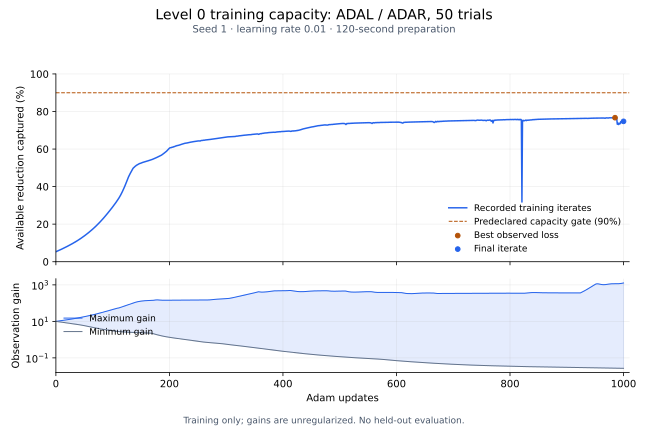

# Level 0 after 1,000 training updates

The declared two-target capacity test **did not pass its 90% gate**. Longer
training improves the fit substantially, but it does not establish convergence
or adequate capacity. New dynamical features remain paused; optimization remains
the next task. The [paired warm-start experiment](CAPACITY-WARM-START.md) implements
the learning-rate follow-up. This experiment produces no validation/test score or LDS comparison.

The [protocol](LEVEL0-CAPACITY-PROTOCOL.md) was executed from clean source
`205c02a`, using ADAL/ADAR's 50 training trials, seed 1's random-sign initialization,
rest −0.2, learned per-neuron gains initially 10, constant-rate Adam at 0.01,
120-second differentiable preparation, and a 0.01-second Euler grid. Classification
and all priors were disabled for this capacity diagnostic. The 1,000-update run
completed in 2,839.7 seconds on CPU, including initial compilation. This elapsed
time includes concurrent audit work and is not a controlled performance benchmark.

## Outcome

| Iterate or reference | Training MSE | Available reduction captured |
| --- | ---: | ---: |
| Zero response | 0.05145506 | 0% |
| Initialized model | 0.05092815 | 5.31% |
| 300 updates | 0.04486787 | 66.41% |
| 500 updates | 0.04416442 | 73.51% |
| Best saved checkpoint: 950 | 0.04386920 | 76.48% |
| Best observed loss: 985 | 0.04384650 | 76.71% |
| Final iterate: 1,000 | 0.04404016 | 74.76% |
| Empirical mean-response bound, constrained to start at zero | 0.04153675 | 100% |

The denominator is zero-response MSE minus the zero-start empirical bound. The
90% gate therefore requires MSE at most 0.04252858. These bounds concern shared
responses to a target; they are not biological noise estimates or guarantees that
the dynamics can attain the empirical means.



The [CSV](capacity-prep120-1000-training.csv) preserves all 1,001 recorded iterates.
The [receipt](level0-capacity-adal-adar-1000.json) retains input and source hashes,
exact training IDs, terminal status, and independent audits. Parameters were
saved every 50 updates: update 985's loss exists in the log, but its parameters
were not saved and have not been independently replayed. It is not a recoverable
selected model. Checkpoint 950 is the best available saved checkpoint.

## Numerical and residual checks

Independent NumPy dynamics reproduce the final and saved-950 MSEs within
1.4e-17 and 6.9e-18, respectively. At the final checkpoint:

- Halving the integration step changes MSE by 3.71e-7; maximum prediction change
  is 0.000838.
- Doubling preparation changes MSE by 8.07e-10; maximum prediction change is
  1.38e-5. Extending it again to 480 seconds makes a negligible further change.
- Removing the stimulus gives MSE 0.05145506, approximately the zero-response
  baseline. Autonomous prediction energy is 4.96e-13 versus 0.006890 with the
  stimulus, a ratio of about 7.2e-11.
- All 3,638 prepared chemical coupling coefficients remain nonzero.

The saved-950 checkpoint also passes the independent replay and step/preparation
controls. These checks support interpreting the retained checkpoints; they do not
verify every unsaved iterate. In particular, the large finite loss spike at update
821 (MSE 0.04829987) has no retained parameter snapshot, so its cause is unresolved.
The full curve also shows the deterioration after the best observed loss at 985.
Neither event is omitted or smoothed away.

Final gains span **0.0268–1,270.98**. They are unregularized calibration parameters,
not physiological estimates. Frozen-dynamics optimal positive per-neuron
rescaling would lower final MSE to 0.04391648, closing only 4.94% of the remaining
gap. Even an inadmissible signed readout gives 0.04376121. Most residual error
therefore cannot be eliminated by amplitude rescaling alone at these dynamics.
These training-only projections are diagnostics, not new fitted benchmark models.

## Decision

Do not scale this configuration to a full-cohort comparison yet. The next bounded
experiment should test a lower learning rate from a retained checkpoint, with
explicitly reset optimizer state if the old moments are unavailable. That must be
called a warm start, not an exact resume. Save the best training parameters as
well as periodic snapshots, so a transient loss minimum is recoverable. Compare
the same trace-only objective and targets, retain the existing capacity threshold,
and repeat independent replay and numerical checks. A missed gate still does not
distinguish model capacity from optimization on its own.

The old held-out partitions remain exploratory; the
[fresh-cohort search](FRESH-HOLDOUT-AUDIT.md) has not secured an independent test
set. No held-out response values were used in this run or its endpoint audits.

The figure can be regenerated from the committed CSV with the optional
`matplotlib` plotting dependency:

```sh
python3 scripts/plot_capacity_curve.py \
  --curve docs/capacity-prep120-1000-training.csv \
  --output docs/capacity-prep120-1000.svg
```

The subsequent [paired warm-start experiment](CAPACITY-WARM-START.md#outcome-both-runs-failed-before-200-updates) stopped on nonfinite gradients in both runs. Solver robustness must be checked before another long fit.
